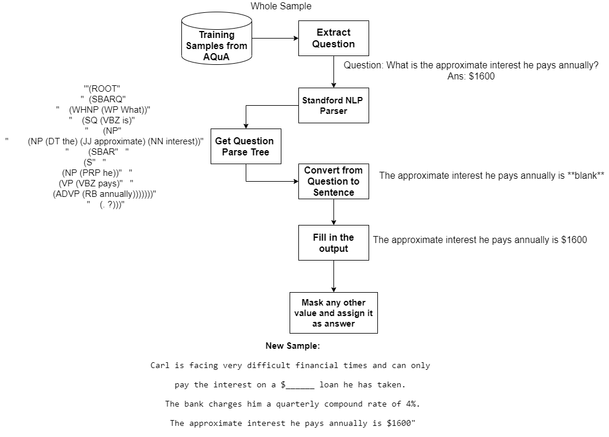

The two approaches I implemented to generate synthesized dataset was proposed in submission of Phase 1 - Dataset Creation (The file can also be found in the current folder named 1217135725_Shivam_raval_Dataset_creation.pds). Both the approaches are explained in below sub-sections:

**1. Text Spinner to generate new samples:**

The implementation of this approach can be found in the folder Text Spinner. The folder contains a file named spin_samples.py which contains the code developed to implement this approach. The training samples from AQuA datatset were used to generate the text spinned synthesized samples.

Text Spinner basically changes the words orientation and original words are changed with their synonyms as well as it changes the grammar of the sentence. Text Spinner does not change the meaning of the sentence and the resultant sentence after spinning would have the same core idea as presented in the original sample. This is useful because we can generate whole new samples which the model can interpret in different ways. The procedure to reach to the answer and the output would remain the same since the spinned sentence would raise the same question but in a different manner. The flow diagram for this method is shown in figure below: 

---


---

In addition to generating new samples, the BLEU-1,2,3,4 scores are calculated between the original and generated sample to analyze the similarity between the text spinned generated sample and original sample. The original sample, text spinned sample and their BLEU scores are stored in Results.csv


**2. Masking and changing the variable to compute:**

The implementation of this approach can be found in the folder Masking. This approach uses standford NLP parser to get the parse tree for the extracted question. The parser can be dowload from https://stanfordnlp.github.io/CoreNLP/download.html. Before running the main program mask.py the stanford NLP parser have to be started using the command: 
``` 
java -mx4g -cp "*" edu.stanford.nlp.pipeline.StanfordCoreNLPServer -port 9000 -timeout 15000. 
```
The POSTree.py contains the code for transforming the question to sentence using the Parse tree given by Stanford NLP parser.
The figure below explains the approach in detail where, firstly the samples from AQuA dataset are taken and the question is extracted from the sample. The question is then passed to the Standford NLP parser which provides the parse tree for the question which is used to convert the question into a sentence. The sentence contains the blank keyword which is the answer of the question and the value of the answer from original samples is filled in the sentence. After that, the whole sample is a paragraph and we can mask any other random number present in the question so that the computation and reasoning required for calculating the mask number would be different than the original question.  


---



---


