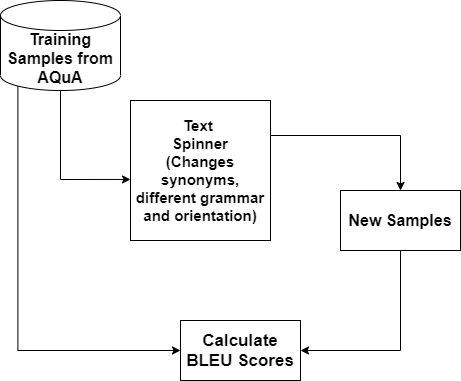

The two approaches I implemented to generate synthesized dataset was proposed in submission of Phase 1 - Dataset Creation (The file can also be found in the current folder named 1217135725_Shivam_raval_Dataset_creation.pds). Both the approaches are explained in below sub-sections:

**1. Text Spinner to generate new samples:**

The implementation of this approach can be found in the folder Text Spinner. The folder contains a file named spin_samples.py which contains the code developed to implement this approach. The training samples from AQuA datatset were used to generate the text spinned synthesized samples.

Text Spinner basically changes the words orientation and original words are changed with their synonyms as well as it changes the grammar of the sentence. Text Spinner does not change the meaning of the sentence and the resultant sentence after spinning would have the same core idea as presented in the original sample. This is useful because we can generate whole new samples which the model can interpret in different ways. The procedure to reach to the answer and the output would remain the same since the spinned sentence would raise the same question but in a different manner. The flow diagram for this method is shown in figure below: 

---

---
