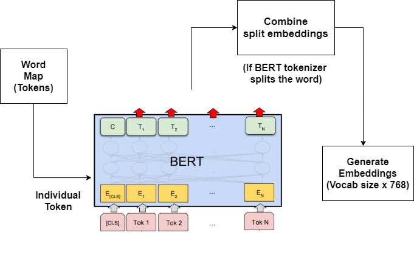
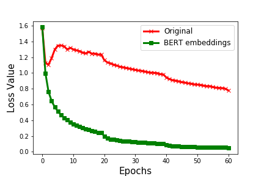
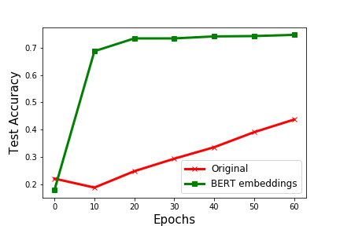

**Modification: Incorporating tokenized BERT Embeddings**

This folder contains the code for the modifcations we did on the original Seq2Tree model. The details of running the model can be found in the Seq2Tree.ipynb. A single node in the tree is made of three main components: a goal vector q, a token y, and a subtree embedding of size n. While reading the paper and implementing the model, we realized that the embedding that is used in the model is trained from scratch rather than using any pre-trained embeddings. We formed a hypothesis that, if we alter the model to initialize the embeddings from pretrained language models like BERT or Roberta, the model can converge faster as well as lead to an improvement in the accuracy. 

We implemented the modification by loading pretrained BERT, getting embeddings for each token in the vocabulary and starting the training with those weights. After training the model, we found our hypothesis to be true. The original Seq2Tree model was implemented using embedding size 128 which was giving out 74.3% accuracy. We implemented the model with embeddings size 768, with and without initializing weights from BERT. The loss and accuracy graph can be found below, It can  be observed from the graph that their original model with embedding size 768 performs poorly when compared to the modified version we implemented by initializing the embedding weights from BERT. It can also be seen that the loss is gradually decreasing and it converges faster than the original model. The original model gives 74.3% accuracy after 80 epochs while the modified model achieved 74.6% accuracy in 60 epochs. We believe that with further fine tuning of the learning rate and weight decay the modified version can achieve better accuracy at half time ( in 40 epochs ). 

---
**Figure represting how the BERT embeddings were generated.**

---

---
**Loss vs Epochs Graph showing modified version is performing better than orginal model without loading pretrained embeddings**

---

---
**Testing Accuracy vs Epochs Graph showing modified version is giving 74.6% accuracy in 60 epochs while their original model with embedding size 768 does not give a good performance.**

---

